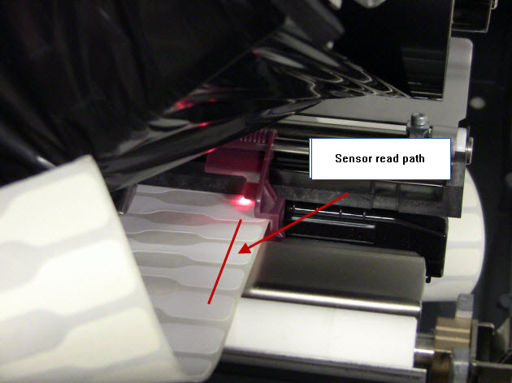

# Label Sensors and You!

The Zebra produced documentation on how the printer's sensors work is scattered to the four winds. This attempts to centralize it based on my observations of printer behavior.

## Detecting things with sensors

There are four things we want to detect in a printer:

* Ribbon
* Label
* Between two labels
* Nothing

Printers use infrared (IR) sensors to either _look through_ or _bounce off_ material to detect these things. Zebra's machines and documents describe these:

* **Transparency Sensor**: Detects the transparency of material, with higher signal indicating higher transparency. A printer with no media loaded should read the highest transparency level.
* **Reflectance Sensor**: Detects the light level bounced off a material, with greater signal indicating greater reflectivity. A black mark on white webbing produces a clear downwards spike in signal.

Each sensor has an associated _threshold_ at which it detects these things. How that threshold is interpreted depends on the print mode and sensor type.

ZPL printers _should_ automatically switch between sensor types when appropriate. EPL printers _will not_ and must be changed manually.

### Ribbon present

The ribbon, as implied, detects whether the ribbon is present or not. When the ribbon runs out (or jams) the printer should stop printing to prevent damage and failed labels.

On most printers that use a ribbon this is done using a _reflective_ IR sensor. The printer bounces an IR LED off of a shiny metal plate. Loading a ribbon blocks the reflecting light, which the printer reads as "higher blocked light".

A higher value means the ribbon is present. This is why Zebra OEM white ribbon will include a shiny metallic 'trailer' towards the end of the spool, this aids in the sensor detecting the end of the ribbon by seeing a lot of reflected light, lowering the sensor value below the 'out' threshold and making the printer stop.

### Media Types

The printer needs to know when the label media is installed, how long it is, and how long the spaces between them are. Nearly all types of media fall into one of four categories:

#### Continuous Media

One long unbroken piece of media the length of the entire spool. Linerless media is continuous, often used by coffee shops, tea shops, and other online order takeout places to label orders. A cutter is used to cut between labels. Receipt paper can be used in this way.

Sometimes continuous media will have 'tractor mark' black lines on the backside. From my research EPL and ZPL printers do not make use of these marks.

The print mode must be set to 'continuous'. The printer uses the transparency sensor to detect media runout.

#### Web Media

The most common label media is opaque label material on top of a semi-transparent webbing backer material. Printers use the transparency sensor to detect the difference in opacity between media, webbing, and media out.

The transpraency sensor uses the spike in transparency of the webbing material to detect the end of one label and the start of the next. When the media runs out the transparency is even higher. The media out threshold is above the web threshold.

Since the sensor is looking for the gap between labels the sensor should be positioned to read the most narrow part of the gap between labels. Rectangular media, such as a 4x6" shipping label, works in this mode normally and can use auto-calibration to size the media correctly.

Some other media requires special handling.

Nonstandard shaped media, such as "barbell" price labels, round labels, media with mutliple labels in a row, etc. may need the sensor to be moved side to side to ensure it's reading the most narrow gap between labels. If the printer's sensor is fixed you may be able to configure an offset in web length to accomodate the difference. Your media supplier may also offer media with black line marks instead.

Clear media, such as fully transparent labels, may not be detected by the printer at all. Usually transparent material will use mark sensing instead.

#### Notch Media

Notched media is common with non-adhesive "tag" stocks that do not have a backing web. There will be a small punched out portion of the material, and depending on the location of the media the printer will use either the transparency or reflective sensor to detect the notch.

#### Mark Media

Marked media is common with oddly shaped media, pre-printed media, clear materials, and generally anything that can't rely on detecting the transparency difference between webbing and media. Most commonly this is a black mark on the back side of the media, which may be offset compared to the exact end of the label.

Printers use a reflective sensor bounced off the back side of the media to detect the mark. The reflectance sensor reads the drop in reflectivity when the black mark passes over the material. When the media runs out the drop is even greater. The media out threshold is lower than the mark threshold.

### Desktop Printers

Read your printer's manual to learn more about where the sensors are located and how they work.

Older and cheaper printers tend to have fixed sensor locations, and if your media's alignment doesn't work with those sensor locations _there is nothing you can do to make that media work in your printer_. Several manufacturers used this as a vendor lock-in mechanism, such as Dymo printers having a sensor offset different than other manufacturers.

In recent years most Zebra printers offer adjustable sensors that can slide around to support different media types. The manual will describe what is supported in your device.

### Industrial Printers

Read your manual, there's gonna be more sensors and more detail about those sensors than I can go into here.

### Label Taken sensor

Printers equipped with a peeler will also have a "label taken" sensor. As each printed label is peeled it will sit on the peeler to be taken. If another label is printed before the label is taken they will start to stack up on the peeler until it jams.

To prevent this the printers have a sensor in the peeler which waits for the label to be removed before printing the next one.

This sensor is reflection based, so **it will usually not detect transparent media**. You may need to implement your own pause between labels.

## Sensor Graphing

The ZPL ~JG command prints a series of labels, up to the Maximum Label Length limit, showing a graph of the sensors. The value will be slightly offset, letting you see the mark or web as it passes over the sensor. If equipped and loaded the ribbon sensor will be shown separately. You can also print the graph using some button combinations, check your printer's manual.

Older printers produced a graph using a filled in black line in a range from 0 to 100 with lines at every 20 units. At the end of the graph the configured thresholds for MEDIA, WEB, and RIBBON levels will be shown. The word "WEB" is re-used for both web and mark sensing, double check the printer is in the correct mode before printing.

* The left graph here shows the ribbon sensor and RIBBON is the ribbon threshold, set to 63, below which the ribbon is 'out'. The word "RIBBON" is repeated at the bottom to indicate which value is being graphed.
* The right graph shows the media sensor in web sense mode with the MEDIA and WEB threshold values. MEDIA is set to 71, above which the media is 'out'. WEB is set to 50, with the 'spike' between labels easily crossing that threshold. The word "MEDIA" is repeated at the bottom to indicate which value is being graphed.

Newer printers don't fill in the sensor line, instead labelling it at the start of the graph's print.

This is a ribbon graph example

1. The ribbon sensor's value, showing low noise.
2. The ribbon threshold value, set to 50.

This is a web sense media graph example

1. The media sensor line, showing low noise over the label and a clear spike between labels.
2. The web sense threshold, set to 50, clearly crossed at each label edge.
3. The media out sense threshold, set to 84, above which media is 'out'.
4. The sensor spike between labels, consistently crossing the web threshold and below the out threshold.
5. The sensor level over the label, showing low noise and well below the web threshold.

This is a mark sense media graph example.

1. The mark media sensor line, showing low noise oer the label and a small dip between labels.
2. The mark sense threshold, set to 56, crossed by the sensor line quickly at the edges of the label. It still uses the word 'WEB' on the graph.
3. The mark media threshold value, set to 23, below which media is 'out'.
4. Reflectivity sensors do not produce as 'clean' of a difference at edges of labels, requiring the mark threshold to be much closer to the level of the label.
5. The sensor level remains mostly above the mark threshold in this chart. If there were issues with extra labels being printed or offsets on labels this value may need to be changed.

### Using graphs for troubleshooting

As a general rule, the more modern the printer the better the auto-calibration will perform. I've observed my ZD411 have no problem at all handling all of my weird test label media stock. Conversely, my oldest LP2844-Z units struggle a lot with auto-cal on anything other than rectangular web media. This library supports manually setting calibration parameters for a reason.

The graphing sensor mode can be used for a variety of troubleshooting tasks to help with media sensing issues. The most basic is confirming the calibrated media levels make sense and are being detected properly.

This photo shows the difference after using isopropyl alcohol on a q-tip to clean the reflectivity sensor on an LP2844-Z. The printer no longer had trouble double-printing. Note how the printer struggled to set the media threshold when it was dirty before correctly setting it afterwards.

This photo shows an incorrectly configured gain for the media transparency sensor on an LP2824 Plus printer. The sensor value is maxing out at 100 when it crosses the web, and the printer can't set the media threshold high enough. The printer treats this as "media out" and couldn't calibrate. The media gain setting was lowered from 53 to 25 and an auto-calibration succeeded.

This photo shows a very low difference between label, web, and media out levels. Even though the values are very close, the low noise of the sensor is good enough for the printer to find the edges of the labels. Web sensing is usually more tolerant than mark sensing. If there were issues with calibration adjusting the media transparency gain higher may produce a greater difference in sensor values.

